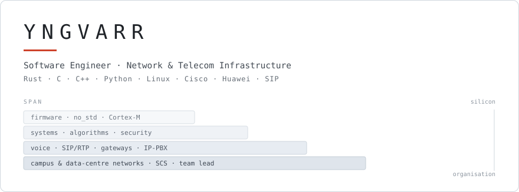

<picture>
  <source media="(prefers-color-scheme: dark)" srcset="assets/banner-dark.svg">
  <source media="(prefers-color-scheme: light)" srcset="assets/banner-light.svg">
  
</picture>

# Yngvarr — systems engineer · head of network infrastructure

**I write the algorithm, and I run the network it describes.**

[`erlang_e1`](https://github.com/xvi-xv-xii-ix-xxii-ix-xiv/erlang_e1) is the Erlang B channel
sizing I have applied to live E1 trunks.
[`xgraph`](https://github.com/xvi-xv-xii-ix-xxii-ix-xiv/xgraph)'s bridge detection finds exactly
the single points of failure a campus topology review looks for. Both are published, versioned
and used by other developers — and both came off the job.

**In IT since 1997** · 8 published packages · **52 000+ downloads** · **24 engineers** led across
**30+ sites**

**Rust · C · C++ · Python · Linux** — **Cisco · Huawei · SIP · E1/PRI**  
Remote, CET/EET · open to roles in the EU and to work with companies across RU/CIS ·

---

## Where the two tracks meet

Plenty of engineers have one of these tracks. What is rare is the edge between them — and every
crate below sits on it.

- **Traffic engineering → code.** Dimensioning voice trunks against a target blocking probability
  is a daily telecom task; `erlang_e1` is that calculation, packaged and published.
- **Topology review → code.** Finding the one link whose failure splits a campus network is
  exactly a graph bridge; `xgraph` computes bridges, betweenness centrality and communities on
  graphs of that shape.
- **Trust boundary → code.** `huginn` validates and sanitizes input at the boundary, written by
  someone who has seen what actually arrives at a production network edge.

---

## Open source

Seven crates on [crates.io](https://crates.io/users/xvi-xv-xii-ix-xxii-ix-xiv) and one package on
[PyPI](https://pypi.org/project/pqcrypt/) — **52 000+ downloads** in total, all documented and
maintained.

| Project | What it is | Latest release | Downloads |
| --- | --- | --- | ---: |
| [xgraph](https://github.com/xvi-xv-xii-ix-xxii-ix-xiv/xgraph) | Graph algorithms — Dijkstra, Kosaraju, Brandes centrality, Leiden communities, bridge detection — over homogeneous graphs and heterogeneous multigraphs | 3.0 · Aug 2026 | 41 500+ |
| [fibonacci_heap](https://github.com/xvi-xv-xii-ix-xxii-ix-xiv/fibonacci_heap) | Fibonacci heap with amortised O(1) `decrease-key`, cascading cuts and link operations | 1.1 · Apr 2026 | 5 000+ |
| [huginn](https://github.com/xvi-xv-xii-ix-xxii-ix-xiv/huginn) | Input sanitization and validation at the trust boundary, with a typed validator pipeline | 1.0 · Apr 2025 | 1 700+ |
| [bearingpro](https://github.com/xvi-xv-xii-ix-xxii-ix-xiv/bearingpro) | Maritime navigation — true and magnetic bearings, deviation, course conversion | 0.12 · Aug 2026 | 1 100+ |
| [erlang_e1](https://github.com/xvi-xv-xii-ix-xxii-ix-xiv/erlang_e1) | Erlang B traffic engineering — sizing E1 voice channels against a target blocking probability | 0.9 · Oct 2024 | 1 100+ |
| [ourobuf](https://github.com/xvi-xv-xii-ix-xxii-ix-xiv/ourobuf) | `no_std` circular buffer with constant-time operations for allocator-free targets | 0.1 · Jan 2025 | 860+ |
| [patternhunt](https://github.com/xvi-xv-xii-ix-xxii-ix-xiv/patternhunt) | Filesystem search — globs, brace expansion, extglobs, regex and metadata predicates, sync or streaming | 0.4 · Aug 2025 | 830+ |

**Newest —** [`pqcrypt`](https://github.com/xvi-xv-xii-ix-xxii-ix-xiv/pqcrypt): post-quantum file
encryption and signing from the command line. ML-KEM (NIST FIPS 203) and ML-DSA (FIPS 204),
hybrid encrypt-then-sign. Published on PyPI.

---

## Infrastructure & telecom

- **Head of network infrastructure department** — campus and data-centre networking and structured
  cabling systems (SCS) for an oil & gas company. **24 engineers** across **30+ sites**, operating
  a switching estate of several thousand devices.
- **Voice and telecom administration** — IP-PBX platforms, voice gateways and session border
  controllers: AudioCodes Mediant, Cisco, Huawei, Eltex, Nortel, Alcatel.
- **Protocols and dimensioning** — SIP, RTP, H.323, E1/PRI trunking, and the traffic engineering
  behind capacity planning.

---

## Engineering focus

- **Systems programming** — Rust, C, C++, Linux, memory- and cache-aware design, concurrency
- **Embedded** — `no_std`, ARM Cortex-M4/M7, STM32, RTIC, ATmega/ATtiny, DMA, USB, UART, real-time constraints
- **Networking** — campus and data-centre switching, structured cabling, TCP/IP, topology and capacity planning
- **Telecom** — SIP, RTP, H.323, E1/PRI, IP-PBX, voice gateways, session border controllers
- **Security** — post-quantum cryptography, encryption and signing, input validation, binary analysis
- **Algorithms** — graphs, data structures, performance work and benchmarking
- **Leadership** — running an infrastructure department: planning, vendor management, incident response

## Stack

**Languages** — Rust · C · C++ · Python · Bash · JavaScript · PHP  
**Embedded** — STM32 · Cortex-M4/M7 · RTIC · ATmega · ATtiny · Raspberry Pi · `no_std`  
**Networking** — Cisco · Huawei · Eltex · HP · campus LAN · data centre · SCS  
**Telecom** — SIP · RTP · H.323 · IP-PBX · AudioCodes Mediant · Nortel · Alcatel · E1/PRI  
**Systems** — Linux (Debian/Ubuntu) · multithreading · async · real-time  
**Data and ML** — PostgreSQL · MySQL · Redis · NumPy · pandas · PyTorch · scikit-learn · NetworkX  
**Tools** — Git · Docker · CI/CD · GDB · CMake

---

## Contact

**[yngvarr.dev@gmail.com](mailto:yngvarr.dev@gmail.com)** · Remote, CET/EET

Open to remote roles in the EU and to work with companies across RU/CIS.
